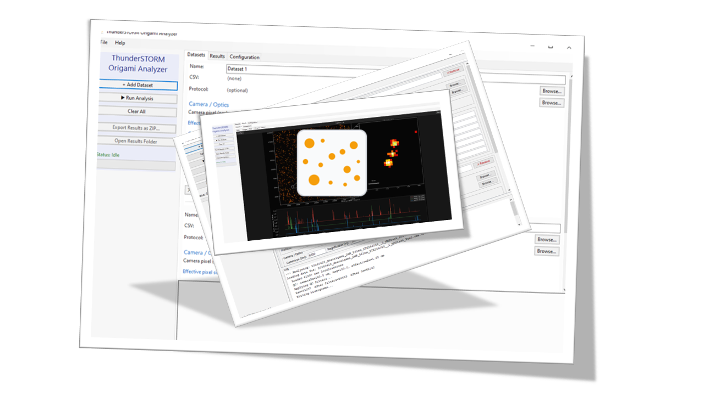
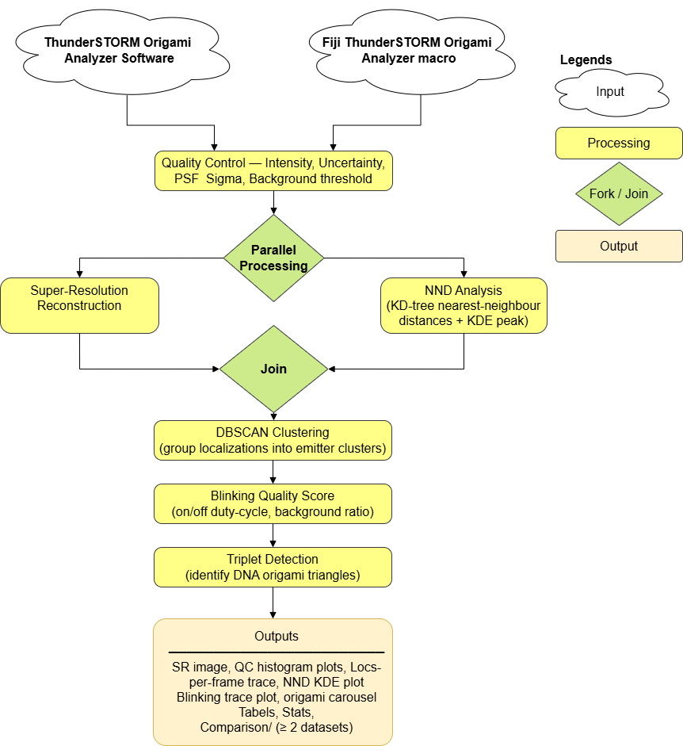
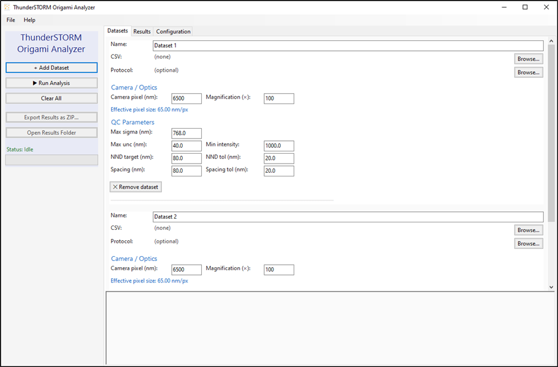
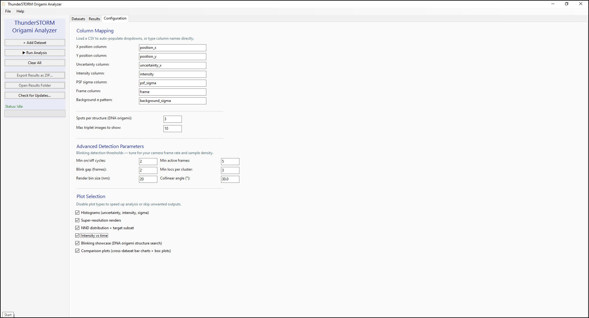
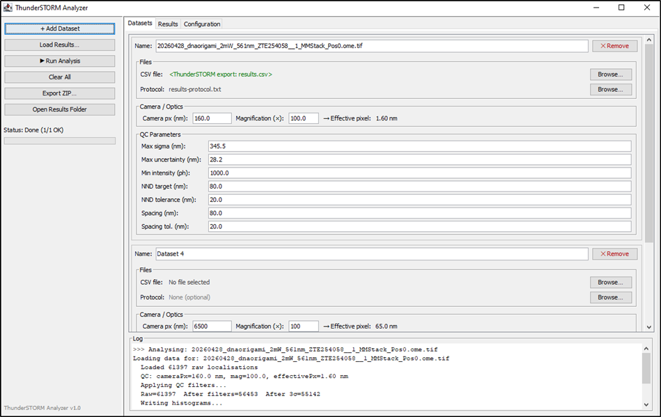
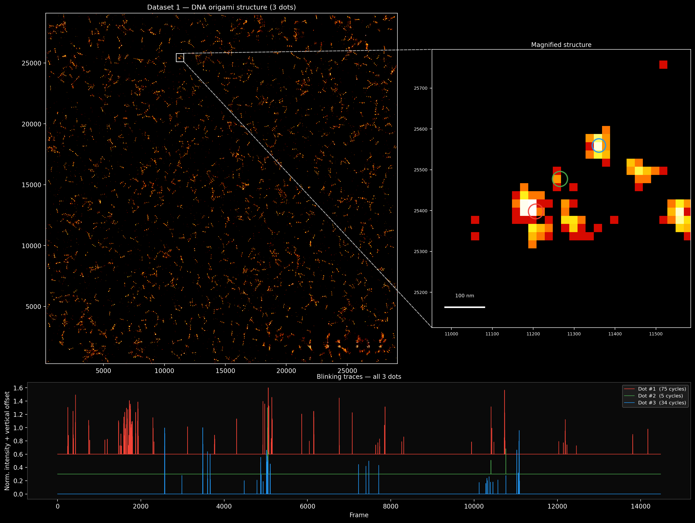
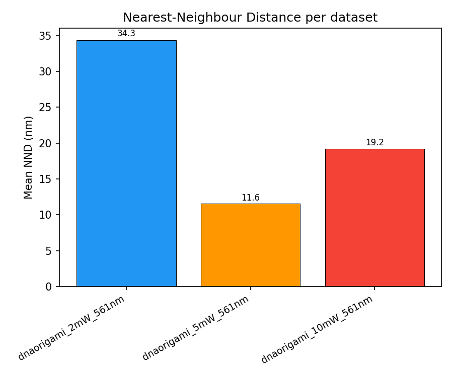
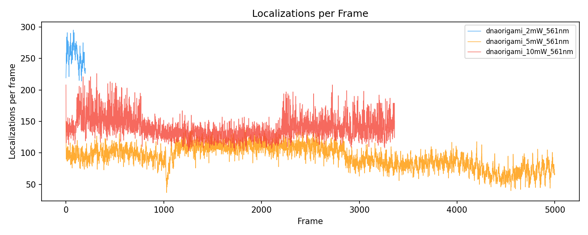

Overview
========

   Preview of the software interface.

**ThunderSTORM Origami Analyzer**, a desktop application that automates the complete post-ThunderSTORM analysis workflow for SMLM data. By combining photon-count and precision-based quality filters, Gaussian-fitted NND analysis, DBSCAN emitter clustering, and a multi-criteria blinking quality score, the tool enables rigorous quality assessment of DNA origami super-resolution datasets without requiring custom scripting. The interactive blinking triplet showcase and cross-dataset comparison plots accelerate data review and facilitate reproducible reporting.

   Analysis workflow of ThunderSTORM Origami Analyzer

**Analysis workflow of ThunderSTORM Origami Analyzer.** Raw localization tables exported from ThunderSTORM are passed through a sequential quality-control pipeline. The filtered data feed a super-resolution rendering engine and a nearest-neighbour distance analyser in parallel. Concurrently, DBSCAN clustering groups repeat localizations per emitter; blinking quality scores are computed and used to detect collinear DNA origami triplets. All outputs are written to the user-specified results directory.

How to Download
===============

Windows
-------

Download the Windows installer:

- `ThunderSTORMAnalyzer.msi <https://github.com/AlAtiat/thunderstormanalyzer/releases/latest/download/ThunderSTORMAnalyzer.msi>`__

This installer is for Windows 10 and Windows 11. After downloading it, run the installer and follow the setup steps.

macOS
-----

Choose the correct DMG file for your Mac:

- `ThunderSTORMAnalyzer for Apple Silicon <https://github.com/AlAtiat/thunderstormanalyzer/releases/latest/download/ThunderSTORMAnalyzer-arm64.dmg>`__

- `ThunderSTORMAnalyzer for Intel Macs <https://github.com/AlAtiat/thunderstormanalyzer/releases/latest/download/ThunderSTORMAnalyzer-x86_64.dmg>`__

Use the Apple Silicon version for Macs with M1, M2, or M3 chips. Use the Intel version for older Intel-based Macs.

After downloading the DMG file, open it and drag the application into the Applications folder.

Linux AppImage
--------------

Download the Linux AppImage:

- `ThunderSTORMAnalyzer.AppImage <https://github.com/AlAtiat/thunderstormanalyzer/releases/latest/download/ThunderSTORMAnalyzer.AppImage>`__

The AppImage works on most Linux distributions and does not need installation.

After downloading it, run:

::

   chmod +x ThunderSTORMAnalyzer.AppImage
   ./ThunderSTORMAnalyzer.AppImage

Linux Flatpak
-------------

Download the Flatpak package:

- `ThunderSTORMAnalyzer.flatpak <https://github.com/AlAtiat/thunderstormanalyzer/releases/latest/download/ThunderSTORMAnalyzer.flatpak>`__

Install it with:

::

   flatpak install ThunderSTORMAnalyzer.flatpak

ImageJ / Fiji Plugin
--------------------

Download the ImageJ / Fiji plugin:

- `ThunderSTORMAnalyzer-Fiji-plugin.jar <https://github.com/AlAtiat/thunderstormanalyzer/releases/latest/download/ThunderSTORMAnalyzer-Fiji-plugin.jar>`__

Releases
--------

The links above always point to the latest release.

All releases and release notes are available on the `GitHub Releases page <https://github.com/AlAtiat/thunderstormanalyzer/releases>`__.

How to Use
==========

Native GUI Software
-------------------

It is actually as straightforward as possible. All you need to do is, after running normal analysis on ThunderSTORM, export the localization table with a table protocol. This is to be loaded and read, and automatic filling of some of the QC parameters, such as max sigma uncertainty, minimum intensity, and camera pixel, will be done depending on the table and its protocol. All others are manually adjustable, such as magnification and spacings in the configuration panel, as well as other configurations, such as spots per structure or even collinear angle and more. It is also possible to add more than one dataset, which will also initiate comparison results between the different datasets. Upon running, results will appear after loading in the results panel (as mentioned “straightforward”).

   **GUI Dataset Panel** The *Datasets* tab allows users to add multiple localization CSV files, assign camera pixel sizes and magnification, and configure per-dataset QC thresholds and spacing target ranges.

Now, other configurations can be set from the configuration panel, where each column mapping the results table from ThunderSTORM can be selected correctly, as well as other parameters such as the target structure spots, the bin size of the rendered image, and more. Also, it is possible to make the rendering quicker by disabling unwanted plots to speed up the analysis as well.

   **GUI Configuration Panel** The *Configuration* tab provides global settings including column-name mapping, DNA origami parameters, advanced blinking thresholds, and toggles for individual output plots.

Fiji Plugin
-----------

For the Fiji plugin, it is constructed exactly the same as the software GUI, yet it has one extra, better feature: it is not necessary to export the data to load the dataset. It is possible to load the active data results table from ThunderSTORM directly using “Load Results...”, where it asks for an output folder in which it will output the table and the results.

   **ThunderSTORM Origami Analyzer Fiji plugin user interface.** The left sidebar provides one-click access to dataset management and analysis control. The *Load Results…* button invokes ThunderSTORM’s built-in ``Export results`` macro to capture the currently open localization table directly into the chosen output directory, bypassing manual CSV export.

Examples
========

Super-resolution Image Reconstruction
-------------------------------------

The super-resolution reconstructions in this example were generated from Gatta Quant example Raw Data (GATTAquant DNA Nanotechnologies - Home, 2026).

.. container:: float

   .. figure:: _static/img/superres_render.png

      Before QC filtering

   .. figure:: _static/img/superres_render_clean.png

      After QC filtering

DNA Origami Detection
---------------------

The detection applied to the reconstructed DNA-PAINT dataset in order to identify groups of three localization clusters that could correspond to individual GATTA-PAINT 80R nanorulers. Figure fig:Top scoring dna origami blinking shows one candidate triplet detected. In the full-field reconstruction, the selected region appears as a localized structure that was further magnified for closer inspection. In the enlarged view, three candidate localization clusters can be distinguished and are marked by colored circles.

The blinking traces below the reconstruction show the temporal behavior of the three detected spots. The three clusters exhibited repeated blinking events over the acquisition respectively.

   **Candidate DNA origami blinking.** **Top left:** Super-resolution reconstruction of the GATTA-PAINT 80R dataset with the selected candidate structure indicated. **Top right:** Magnified view of the selected region showing three candidate localization clusters, highlighted by colored circles. **Bottom:** Corresponding blinking traces of the three detected spots. Together, the spatial grouping and repeated temporal detection support the classification of this structure as a candidate DNA origami triplet.

Cross-Dataset Comparison
------------------------

Nearest-Neighbour Distance Analysis
~~~~~~~~~~~~~~~~~~~~~~~~~~~~~~~~~~~

The nearest-neighbour distance analysis is used to compare the characteristic localization spacing between datasets as shown in Figure fig:NND mean comparison.

   **Mean nearest-neighbour distance comparison.** Mean nearest-neighbour distance values calculated for the DNA-PAINT datasets acquired at :math:`2\,\mathrm{mW}`, :math:`5\,\mathrm{mW}`, and :math:`10\,\mathrm{mW}` excitation power using the :math:`561\,\mathrm{nm}` laser. The measured mean distances were :math:`34.3\,\mathrm{nm}`, :math:`11.6\,\mathrm{nm}`, and :math:`19.2\,\mathrm{nm}`.

Localization uncertainty and intensity distributions
~~~~~~~~~~~~~~~~~~~~~~~~~~~~~~~~~~~~~~~~~~~~~~~~~~~~

The localization uncertainty and intensity distributions between datasets are as shown in Figure fig:Uncertainty intensity boxplots.

.. container:: float

   .. figure:: _static/img/uncertainty_boxplot.png

      Localization uncertainty

   .. figure:: _static/img/intensity_boxplot.png

      Localization intensity

Localizations per frame
~~~~~~~~~~~~~~~~~~~~~~~

The number of detected localizations per frame for the DNA-PAINT datasets acquired at :math:`2\,\mathrm{mW}`, :math:`5\,\mathrm{mW}`, and :math:`10\,\mathrm{mW}` excitation power as shown in Figure fig:Localizations per frame.

   **Localizations per frame for DNA-PAINT datasets.** Number of detected localizations per frame for the datasets acquired at :math:`2\,\mathrm{mW}`, :math:`5\,\mathrm{mW}`, and :math:`10\,\mathrm{mW}` excitation power using the :math:`561\,\mathrm{nm}` laser.

Deep Dive
=========

ThunderSTORM Origami Analyzer
-----------------------------

The localization tables exported from ThunderSTORM can be further analyzed using a ThunderSTORM Origami Analyzer. This custom analysis tool accepts ThunderSTORM CSV files together with a configuration protocol file in ``.txt`` format. The configuration file defines the analysis parameters used for each run, allowing the detected localizations to be evaluated with respect to the expected DNA origami nanoruler geometry.

The software uses the Python package :math:`\texttt{Locan}` (:math:`\geq 0.21.0`) to handle and process localization data (Doose, 2022). Additional Python packages used for data handling, numerical analysis, clustering, and visualization included :math:`\texttt{NumPy}`, :math:`\texttt{Pandas}`, :math:`\texttt{SciPy}`, :math:`\texttt{scikit-learn}`, and :math:`\texttt{Matplotlib}`. After importing the ThunderSTORM results, the localizations will be filtered, grouped, and analyzed to generate quantitative outputs such as localization cluster positions and inter-cluster distances. In this way, the reconstructed localization clusters could be compared with the known spacing of nanoruler. The Fiji plugin, A parallel pure-Java implementation is distributed as a Maven-packaged fat JAR that installs directly into ``Fiji.app/plugins/`` and registers as ``Plugins > ThunderSTORM > ThunderSTORM Origami Analyzer``. The plugin reproduces the complete analysis pipeline in Java and has an extra *Load Results…* button that triggers ThunderSTORM’s own ``Export results`` macro to write the currently open localization table directly to an output directory, eliminating manual export of CSV files. See complete workflow fig:ThunderSTORM Origami Analyzer Workflow.

Quality Control Filtering
~~~~~~~~~~~~~~~~~~~~~~~~~

Four sequential quality-control filters will be applied to the raw localization table before further analysis. First, a minimum photon-count threshold  used to remove weak localizations, where only localizations with :math:`I > I_{\min}` were retained. Second, localizations filtering according to their localization precision by retaining only events with :math:`\sigma_{\mathrm{loc}} < \sigma_{\max}`. Third, a constraint on the fitted PSF size is applied by requiring :math:`\sigma_{\mathrm{PSF}} < \sigma_{\mathrm{PSF,max}}`, which helped exclude out-of-focus events or incorrectly fitted signals. Finally, intensity outliers gets removed using a three-sigma criterion, :math:`\left| I - \overline{I} \right| < 3\sigma_I`, where :math:`\overline{I}` and :math:`\sigma_I` are the mean and standard deviation of the intensity distribution after the previous filtering steps.

.. _super-resolution-image-reconstruction-1:

Super-resolution image reconstruction
~~~~~~~~~~~~~~~~~~~~~~~~~~~~~~~~~~~~~

After filtering, the localization coordinates is used to generate a two-dimensional super-resolution reconstruction using the ``render_2d`` function from ``Locan``. This works by binning the :math:`x,y`-coordinates into regular bins (Doose, 2022). Therefore, the reconstructed image represents a two-dimensional histogram of localization counts instead of a Gaussian-rendered image. A 3d rendering is not yet established but is one of the main improvement points.

The reconstruction bin size defines the pixel size of the final rendered image and determines how finely the localization coordinates are displayed. The rendering attempts first with the configured bin size. If memory limitations occurred, the software automatically repeated the rendering using coarser bin sizes. The rendered image is displayed with intensity equalization and a false-color lookup table to improve visual contrast. 

Nearest-neighbor distance analysis
~~~~~~~~~~~~~~~~~~~~~~~~~~~~~~~~~~

Nearest-neighbor distance analysis is used to estimate the characteristic spacing between detected localization clusters. Nearest-neighbor methods are a standard approach in spatial point-pattern analysis for quantifying distances between neighboring points (Dixon, 2001). In the analysis, each localization cluster was represented by its centroid position :math:`\mathbf{r}_i`, and the nearest-neighbor distance is defined as the shortest Euclidean distance from this centroid to any other cluster centroid:

.. math::

   d_i =
   \min_{j \neq i}
   \left\|
   \mathbf{r}_i - \mathbf{r}_j
   \right\| .

The resulting distance values are analyzed for each localization cluster. If fewer than 20 distances are available, the median distance is used as a descriptive estimate and no Gaussian fit is performed. For larger datasets, the nearest-neighbor distance distribution is smoothed using a Gaussian kernel density estimate (KDE) with Silverman’s bandwidth rule (Dehnad, 1987). The KDE is evaluated over the measured distance range up to a maximum of :math:`600\,\mathrm{nm}`, and the dominant peak is identified as the global maximum of the KDE curve.

To refine the peak position, a Gaussian function is fitted to the KDE values within a window around the detected peak:

.. math::

   f(d)
   =
   A
   \exp\left[
   -\frac{1}{2}
   \left(
   \frac{d-\mu_{\mathrm{NND}}}{\sigma_{\mathrm{NND}}}
   \right)^2
   \right],

where :math:`A` is the fitted amplitude, :math:`\mu_{\mathrm{NND}}` is the fitted peak position, and :math:`\sigma_{\mathrm{NND}}` describes the width of the fitted distance distribution. The fitted peak position :math:`\mu_{\mathrm{NND}}` is used as the characteristic nearest-neighbor distance.

DBSCAN clustering of localization clusters
~~~~~~~~~~~~~~~~~~~~~~~~~~~~~~~~~~~~~~~~~~

Density-based spatial clustering of applications with noise (DBSCAN) was used to group spatially related localizations into localization clusters. It is applied using ``Locan`` using a neighbourhood radius :math:`\varepsilon`, which defines the maximum distance between neighbouring localizations within the same cluster (Doose, 2022) :

.. math::

   \varepsilon
   =
   \max\left[
   10\,\mathrm{nm},
   \min\left(
   2p_{\mathrm{px}},
   \frac{s_{\mathrm{DNA}}}{2.2}
   \right)
   \right]

where :math:`p_{\mathrm{px}}` is the effective camera pixel size in nanometers and :math:`s_{\mathrm{DNA}}` is the expected signal-to-signal spacing of the nanoruler. The lower limit of :math:`10\,\mathrm{nm}` is included as a safeguard to prevent the DBSCAN neighborhood radius from becoming unrealistically small due to configuration values. This ensured that repeated localizations from the same docking site could still be grouped, while the upper constraint based on :math:`s_{\mathrm{DNA}}/2.2` reduced the risk of merging neighboring docking sites. This is used to group repeated localizations from the same docking site while reducing the chance that neighboring docking sites on the same origami structure were merged into one cluster. A localization :math:`\mathbf{r}_i` is considered a core point when the number of neighboring points within the radius :math:`\varepsilon` fulfilled

.. math::

   \left|
   \mathcal{N}_{\varepsilon}(\mathbf{r}_i)
   \right|
   \geq
   \mathrm{MinPts},

where :math:`\mathcal{N}_{\varepsilon}(\mathbf{r}_i)` is the set of neighbouring localizations within the radius :math:`\varepsilon`, and :math:`\mathrm{MinPts}` is the minimum number of points required to form a cluster.

Blinking quality score
----------------------

For each DBSCAN cluster, a custom blinking quality score is calculated to rank how reliably the corresponding emitter site contributed localization events over time. The score combined the number of detected blinking cycles, the number of frames in which the emitter is observed, the stability of the photon counts, and the temporal structure of the blinking trace.

First, the frame indices belonging to each localization cluster are sorted. Consecutive localizations are considered part of the same ON event when the gap between their frame indices did not exceed a defined threshold :math:`g_{\max}`. If the gap between two detected frames is larger than :math:`g_{\max}`, a new ON event is counted. The number of blinking cycles is calculated as

.. math::

   N_{\mathrm{cycles}}
   =
   1+
   \sum_{m=1}^{M-1}
   \mathbf{1}\!\left(f_{m+1}-f_m>g_{\max}\right),

where :math:`f_m` are the sorted frame indices of the cluster, :math:`M` is the number of detected frames, :math:`g_{\max}` is the maximum allowed gap within one ON event, and :math:`\mathbf{1}[\cdot]` is an indicator function.

To describe the temporal structure of the blinking trace, the detected frames are converted into a binary trace :math:`b[t]`, where :math:`b[t]=1` indicates detection in frame :math:`t`, and :math:`b[t]=0` indicates no detection. The discrete Fourier transform of this binary trace is calculated as

.. math::

   \hat{b}[k]
   =
   \sum_{t=0}^{T-1}
   b[t]\,
   \exp\!\left(-\frac{2\pi i k t}{T}\right),

where :math:`T` is the total number of frames and :math:`\hat{b}[k]` is the Fourier coefficient at frequency index :math:`k`. The zero-frequency component is removed because it only represents the average number of ON frames. A temporal score :math:`P` is then calculated as the fraction of the Fourier magnitude contained in the strongest nonzero frequency component:

.. math::

   P
   =
   \frac{\max_k |\hat{b}[k]|}
   {\sum_k |\hat{b}[k]|}.

Photon-count stability is evaluated using the coefficient of variation of the per-frame intensities,

.. math::

   \mathrm{CV}
   =
   \frac{\sigma_I}{\overline{I}},

where :math:`\overline{I}` is the mean per-frame intensity and :math:`\sigma_I` is its standard deviation. The intensity consistency factor is calculated as

.. math::

   C
   =
   \frac{1}{\mathrm{CV}+\epsilon},

where :math:`\epsilon` is a small constant used to avoid division by zero. A lower coefficient of variation corresponds to more stable photon emission and therefore gives a higher consistency factor.

The final blinking quality score is calculated as

.. math::

   Q
   =
   N_{\mathrm{cycles}}
   \cdot
   N_{\mathrm{frames}}
   \cdot
   C
   \cdot
   (1+P),

where :math:`N_{\mathrm{frames}}` is the number of unique frames in which the emitter is detected. Higher :math:`Q` values indicate clusters with repeated blinking events, sufficient temporal coverage, stable photon emission, and a stronger temporal signal. This custom score is used to rank localization clusters before searching for DNA origami.

.. _dna-origami-detection-1:

DNA origami detection
~~~~~~~~~~~~~~~~~~~~~

To identify intact DNA origami nanorulers, the software searches for localization clusters with distances and geometry consistent with the expected structure. Only clusters with a positive blinking quality score were included in the search; for details on the score calculation, see Section subsec:Blinking quality score. First, all cluster pairs :math:`(i,j)` with an inter-cluster distance within the target range were identified:

.. math::

   s_{\mathrm{DNA}}-\delta
   \leq
   \left\|
   \mathbf{r}_i-\mathbf{r}_j
   \right\|
   \leq
   s_{\mathrm{DNA}}+\delta ,

where :math:`s_{\mathrm{DNA}}` is the expected signal-to-signal spacing and :math:`\delta` is the allowed distance tolerance. 

For each valid pair, the software searches for a cluster :math:`k` that was positioned consistently with the nanoruler geometry. Candidates are then tested for approximate collinearity. Valid candidates were ranked using a score based on the blinking behavior of the clusters. The score was calculated as

.. math::

   S_{\mathrm{triplet}}
   =
   N_{\mathrm{cycles,min}}^{2}
   \cdot
   \overline{N}_{\mathrm{cycles}}
   \cdot
   \left(
   Q_i+Q_j+Q_k
   \right),

where :math:`N_{\mathrm{cycles,min}}` is the smallest number of blinking cycles among the clusters, :math:`\overline{N}_{\mathrm{cycles}}` is the mean number of blinking cycles, and :math:`Q_i`, :math:`Q_j`, and :math:`Q_k` are the blinking quality scores of the clusters. This scoring approach penalizes candidates in which one of the spots shows poor blinking behavior, while favoring clusters with balanced and repeated localization events at all expected dye positions.

After detection, the structure spots were ordered per score for visualization. For each selected cluster, the software generated a zoomed in super-resolution image with color-coded cluster markers and synchronized blinking traces, allowing the spatial arrangement and temporal behavior of the detected nanoruler sites to be evaluated together.

.. _bibliography:

References
==========

.. container:: references csl-bib-body hanging-indent
   :name: refs

   .. container:: csl-entry
      :name: ref-dehnadDensityEstimationStatistics1987

      Dehnad, K. (1987). Density Estimation for Statistics and Data Analysis. *Technometrics*. https://doi.org/10.1080/00401706.1987.10488295

   .. container:: csl-entry
      :name: ref-dixonNearestNeighborMethods2001

      Dixon, P. M. (2001). Nearest Neighbor Methods. *Encyclopedia of Environmetrics*. https://doi.org/10.1002/9780470057339.van007

   .. container:: csl-entry
      :name: ref-dooseLOCANPythonLibrary2022

      Doose, S. (2022). LOCAN: A python library for analyzing single-molecule localization microscopy data. *Bioinformatics*. https://doi.org/10.1093/bioinformatics/btac160

   .. container:: csl-entry
      :name: ref-GATTAquantDNANanotechnologies

      *GATTAquant DNA Nanotechnologies - Home*. (2026). https://www.gattaquant.com/.
